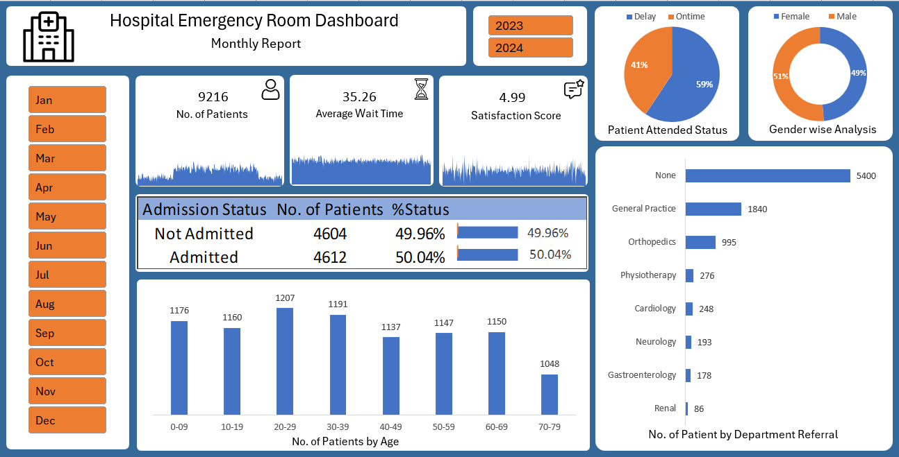

# 🏥 Hospital Emergency Room Dashboard

## 📌 Project Overview
This Excel-based interactive dashboard provides valuable insights into the operations of a hospital’s Emergency Room (ER). It enables stakeholders to **monitor**, **analyze**, and **make data-driven decisions** to improve patient management and enhance service quality.

